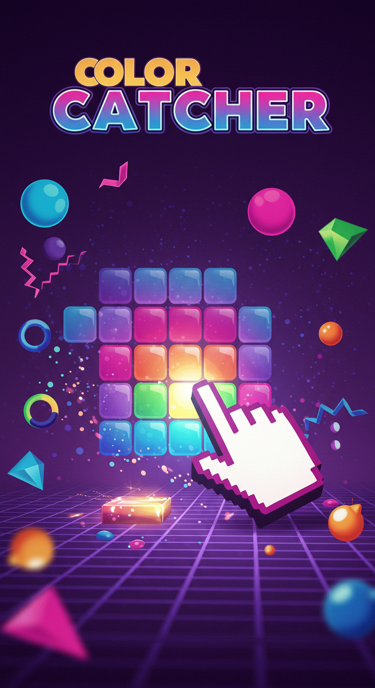

# 🎨 Renk Yakalama Oyunu (Color Catcher)

Hızlı reflekslerinizi test eden, eğlenceli bir renk yakalama oyunu! Hedef rengi bul ve hızlıca tıkla.

## 🎮 Nasıl Oynanır?

1. **Başlangıç**: "BAŞLA" butonuna tıklayarak oyunu başlatın
2. **Hedef**: Üst kısımda gösterilen hedef rengi bulun
3. **Yakalama**: Hedef renkle aynı olan kutuya tıklayın
4. **Puanlama**: 
   - Doğru renk = +10 puan
   - Yanlış renk = -5 puan ve -3 saniye
5. **Süre**: 60 saniye içinde en yüksek puanı yapmaya çalışın

## 🌟 Özellikler

- **Dinamik Zorluk**: Her 100 puanda bir oyun hızlanır
  - Renk değişim süresi azalır (5 saniyeden başlar, minimum 1.5 saniye)
  - Bonus süre azalır (3 saniyeden başlar, minimum 1 saniye)
  
- **Bonus ve Cezalar**:
  - Doğru renk = Bonus süre kazanımı
  - Yanlış renk = Süre ve puan kaybı
  
- **Görsel Efektler**:
  - Puan kazanma/kaybetme animasyonları
  - Neon efektli butonlar
  - Modern ve dinamik arayüz

## 🛠️ Teknolojiler

- HTML5
- CSS3 (Modern efektler ve animasyonlar)
- JavaScript (Saf JavaScript, framework kullanılmadı)

## 🎯 İpuçları

1. Hızlı olun ama dikkatli seçim yapın
2. Yanlış seçimlerden kaçının, süre kaybı kritik
3. Her 100 puan oyunu zorlaştırır, hazırlıklı olun
4. Bonus süreleri akıllıca kullanın

## 🔄 Güncellemeler

Oyun sürekli geliştirilmektedir. Yeni özellikler ve iyileştirmeler için takipte kalın!

## 📝 Lisans

Bu proje MIT lisansı altında lisanslanmıştır.
